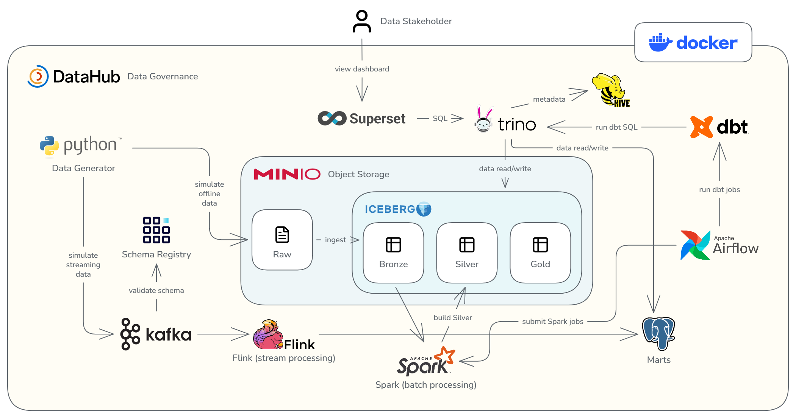

# CineFlux - Movie Streaming Data & Intelligence Platform

CineFlux is an end-to-end **Data & Intelligence Platform** for the movie-streaming domain. It models the backend capabilities required to collect, process, organize, analyze, and operationalize large-scale streaming data.

This repository currently delivers **Phase 1 — Scalable Data Platform**. Later phases will extend the platform with ML personalization, Agentic AI, and production hardening. Those future capabilities are part of the broader CineFlux vision but are not implemented in the current phase.

## Table of Contents

- [Business Domain](#business-domain)
- [Current Delivery Scope](#current-delivery-scope)
- [Deployment Architecture](#deployment-architecture)
- [Components](#components)
- [Documentation](#documentation)

## Business Domain

A movie-streaming service continuously produces behavioral events such as playback starts, progress updates, and completions. It also receives recurring batch updates for users, subscriptions, and content metadata.

CineFlux turns these raw sources into reliable analytical datasets and reusable offline features. The complete platform is designed to support analytics, personalized recommendations, semantic discovery, and AI-assisted operations as it evolves through later phases.

CineFlux does not host or deliver video. Video storage, playback delivery, transcoding, DRM, CDN, billing, and a consumer-facing streaming application are outside the project scope.

## Current Delivery Scope

Phase 1 focuses on the data-platform foundation:

- Synthetic batch and streaming data generation.
- Batch ingestion and distributed processing.
- Event-stream transport and event-time processing.
- Bronze, Silver, Gold, and offline Feature data layers.
- Distributed SQL modeling and analytical access.
- Pipeline orchestration, data quality, metadata, and lineage.
- Reproducible optimization evidence and technical documentation.
- Local deployment with Docker and Docker Compose.

## Deployment Architecture

## Components

- [Data Generator](data_platform/generator/README.md) produces deterministic batch files in
  MinIO and playback event streams in Kafka.
- [Spark Processing Jobs](data_platform/spark_jobs/README.md) ingest landing files into
  append-only Bronze tables and rebuild validated Silver tables.
- [Flink Streaming Jobs](data_platform/flink_jobs/README.md) validate Kafka playback events,
  handle late and duplicate records, and upsert five-minute metrics into PostgreSQL.
- [dbt Analytics Models](data_platform/dbt/README.md) build deterministic Gold dimensions,
  analytical marts, offline features, and the PostgreSQL serving copy.
- [Airflow Orchestration](docs/Orchestration.md) coordinates the batch pipelines and
  Iceberg maintenance with explicit ingest and validation stages.
- [DataHub Governance](docs/DataGovernance.md) catalogs platform metadata and presents
  runtime lineage, validation results, contracts, ownership, domains, and tags.

## Documentation

Detailed implementation evidence is organized by platform area:

- [Docker](docs/Docker.md)
- [Data Generator](docs/DataGenerator.md)
- [Processing Jobs](docs/ProcessingJobs.md)
- [Data Storage](docs/DataStorage.md)
- [Orchestration](docs/Orchestration.md)
- [Data Governance](docs/DataGovernance.md)
- [Schema Design](docs/SchemaDesign.md)
- [Novel Ideas](docs/NovelIdeas.md)
