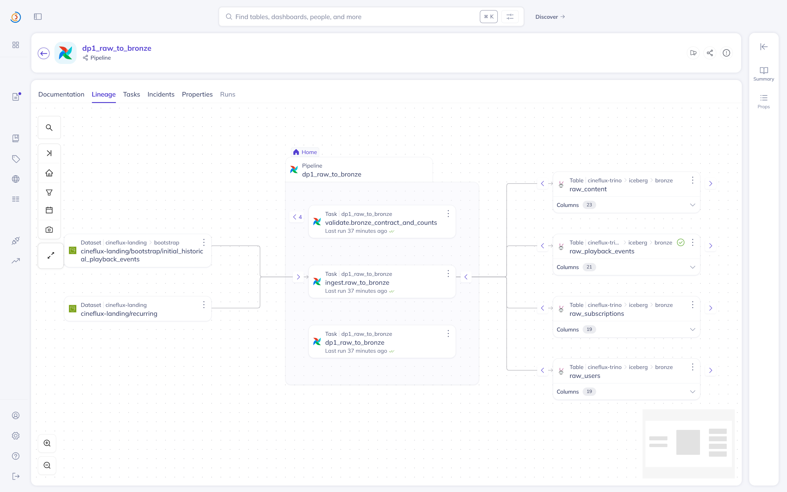
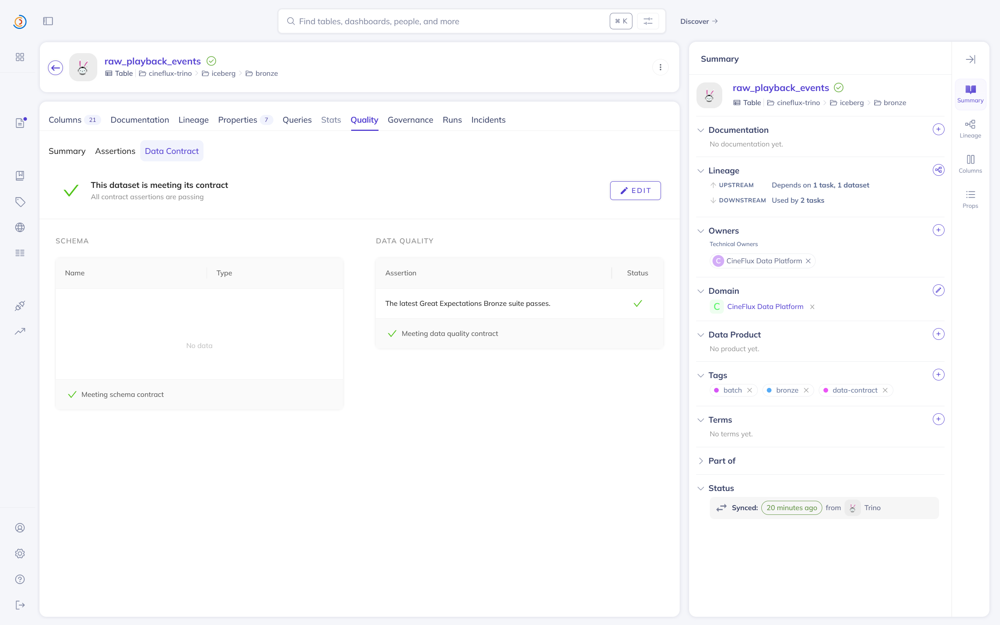
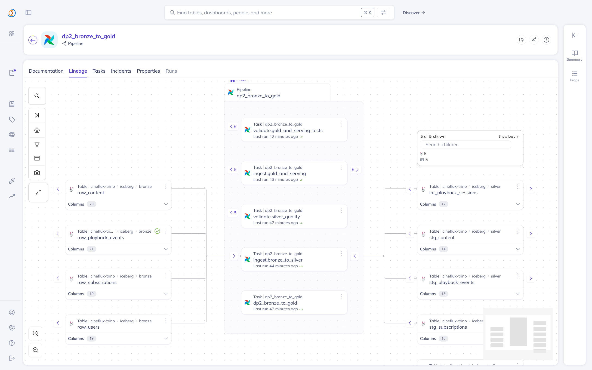
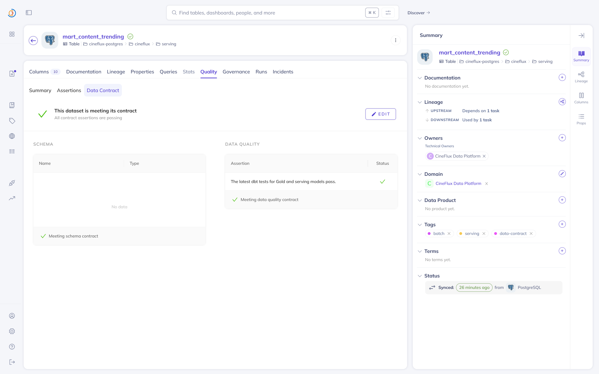
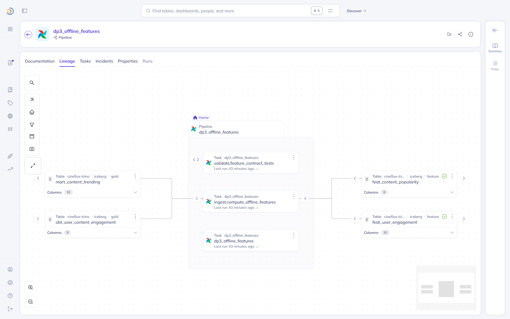
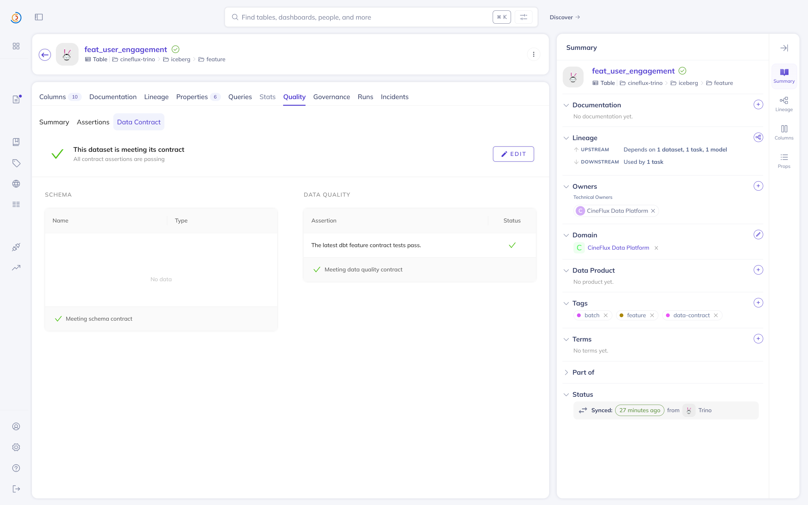

# Data Governance

DataHub catalogs the lakehouse, serving, and streaming assets used by CineFlux. Metadata is
ingested from Trino, PostgreSQL, Kafka, Schema Registry, and dbt. Airflow publishes runtime
lineage through OpenLineage, while Great Expectations and dbt publish validation results.

Governed datasets are assigned to the `CineFlux Data Platform` owner and domain. Controlled
tags identify the processing mode, data layer, serving role, and contract coverage.

## Published Metadata

| Source | Published metadata |
|---|---|
| Trino and Iceberg | Bronze, Silver, Gold, and Feature datasets |
| PostgreSQL | Serving and streaming tables |
| Kafka and Schema Registry | Topics and Avro schema contracts |
| dbt | Models, tests, documentation, and column lineage |
| Airflow OpenLineage | Runtime pipeline, task, input, and output lineage |
| Great Expectations and dbt tests | Latest validation and contract assertion results |

## Pipeline Evidence

### Raw To Bronze



The runtime graph connects landing datasets to the ingest and validation tasks and the four
Bronze outputs.



The Bronze playback contract is active, its Great Expectations quality assertion passes,
and the dataset has the expected owner, domain, and controlled tags.

### Bronze To Gold And Serving



The runtime graph connects Bronze inputs through separate Silver and Gold/serving ingest and
validation tasks to their downstream datasets.



The PostgreSQL serving mart meets its schema and quality contract, backed by the latest dbt
tests for the Gold and serving models.

### Offline Features



The runtime graph connects Gold inputs to feature computation and contract validation, with
both offline Feature tables visible as outputs.



The user-engagement feature contract passes its schema and dbt quality assertions and shows
the shared ownership, domain, and feature tags.

## Verification

| Check | Result |
|---|---:|
| Runtime pipelines with input/output lineage | 3 |
| Great Expectations Bronze checks | 5 / 5 passed |
| Gold and serving dbt tests | 8 / 8 passed |
| Feature dbt tests | 36 / 36 passed |
| Published data contracts | 5 |
| Contract assertions | 9 / 9 passed |

The five contracts cover Bronze playback events, the PostgreSQL serving mart, both offline
Feature tables, and the Schema Registry Avro contract for the streaming playback topic.

## Run

```bash
make governance-build
make governance-up
make governance-publish
make governance-verify
```
