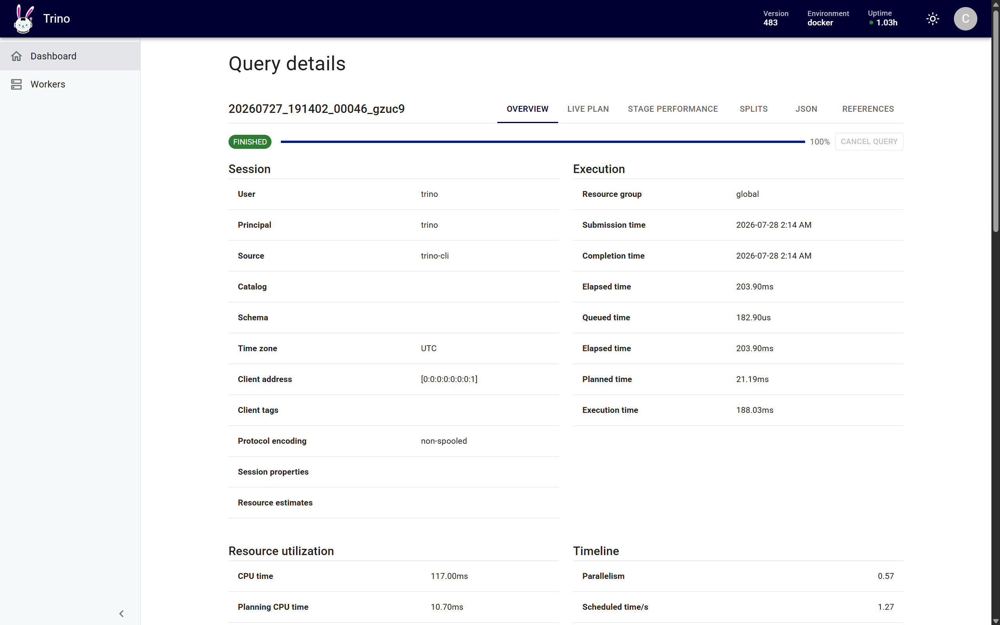
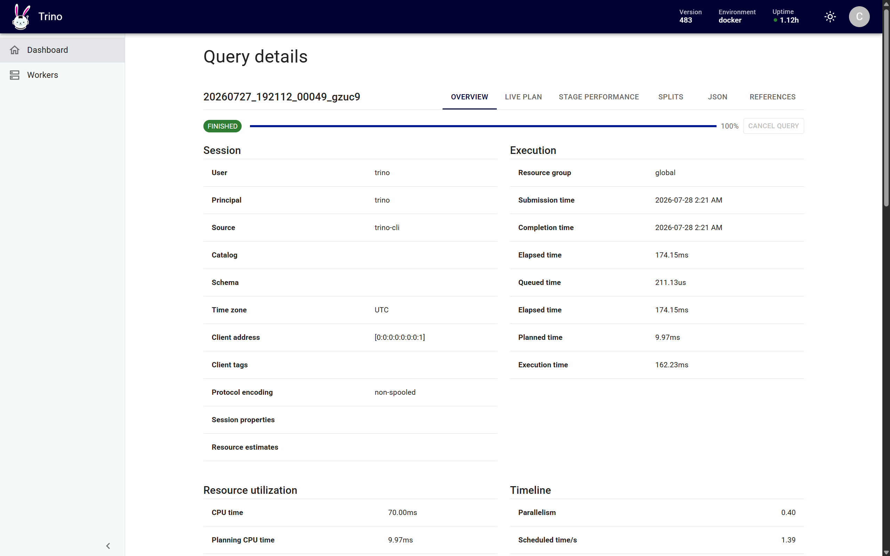
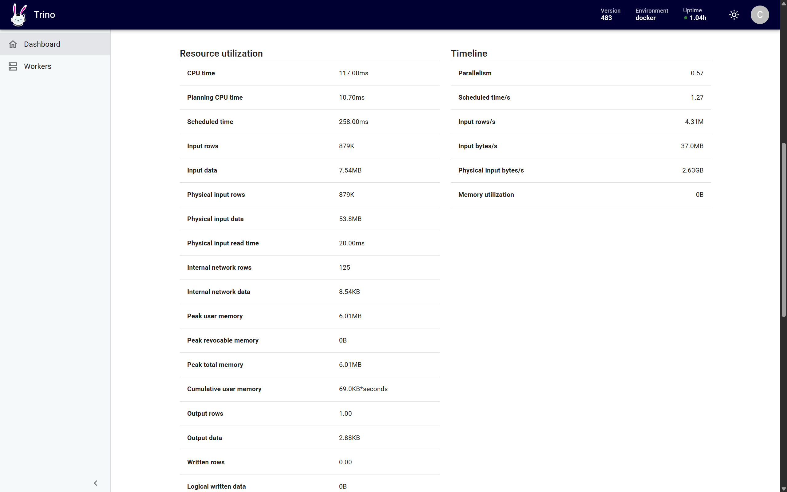
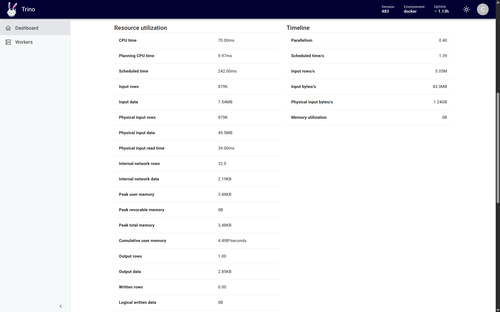

# Data Storage

## Iceberg Small-File Compaction

`bronze.raw_playback_events` is partitioned by `days(event_timestamp)`. The storage
ingestion configuration intentionally writes four files per daily partition, then Iceberg
bin-pack compaction targets one larger file per partition with a 128 MiB target size.
Daily partitions contain less than the target, so the resulting files average 1.67 MB;
Iceberg does not combine data across partition boundaries.

The benchmark scans December 2025 with the same query before and after compaction.

| Metric | Before | After | Change |
|---|---:|---:|---:|
| Data files scanned | 124 | 31 | -75.0% |
| Average file size | 454,946 B | 1,673,424 B | 3.68x |
| Total file size | 56,413,357 B | 51,876,132 B | -8.0% |
| Records | 878,664 | 878,664 | Unchanged |
| Planning time | 21.19 ms | 9.97 ms | -53.0% |
| Execution time | 188.03 ms | 162.23 ms | -13.7% |
| Elapsed time | 203.90 ms | 174.15 ms | -14.6% |
| Physical input | 53.8 MB | 49.5 MB | -8.0% |

Whole-table validation reduced `720` files to `180` across `180` daily partitions. Row
count remained `5,102,060`, distinct `event_id` count remained `5,000,000`, and the snapshot
changed from `356148303114742169` to `6997112828773688091`. All `720` input files were
rewritten successfully with no failed files.

The compaction job executes the following Iceberg procedure and rejects a rewrite that
changes logical data or does not reduce the file count:

```python
table = self._config.table
target = f"{table.namespace}.{table.name}"
statement = f"""
    CALL {self._settings.catalog_name}.system.rewrite_data_files(
        table => '{target}',
        strategy => '{self._config.strategy}',
        options => map(
            'target-file-size-bytes', '{self._config.target_file_size_bytes}',
            'min-input-files', '{self._config.min_input_files}',
            'partial-progress.enabled', 'false'
        )
    )
"""
with self.spark_action(
    "iceberg.compaction.rewrite_data_files",
    f"Compact Iceberg {target}",
):
    result = self.spark.sql(statement).first()
self.metrics["rewrite"] = result.asDict(recursive=True) if result else {}

target = self._iceberg.read(table.namespace, table.name)
after_data = self._data_metrics(target)
after_files = self._file_metrics()
self.metrics["after"] = {"data": after_data, "files": after_files}
if after_data != self._before_data:
    raise ValueError("Compaction changed the logical table metrics")
before_file_count = self.metrics["before"]["files"]["file_count"]
if after_files["file_count"] >= before_file_count:
    raise ValueError(
        "Compaction did not reduce the number of current data files"
    )
```

| Before | After |
|---|---|
|  |  |
|  |  |

## PostgreSQL Serving Index

The serving query returns the top 100 content windows ordered by popularity score, window,
and content ID. A single matching B-tree index replaces a full-table scan and sort.

```sql
CREATE INDEX IF NOT EXISTS idx_mart_content_trending_score
    ON mart_content_trending (
        popularity_score DESC,
        window_start DESC,
        content_id ASC
    );

ANALYZE mart_content_trending;
```

| Metric | Before | After |
|---|---:|---:|
| Plan | Parallel Seq Scan | Index Scan |
| Execution time | 99.741 ms | 0.109 ms |
| Scan buffers | 961 hit, 46,221 read | 103 hit, 0 read |
| Result rows | 100 | 100 |
| Result checksum | `1098aa538bd4d59472dc1306a98c9aa6` | `1098aa538bd4d59472dc1306a98c9aa6` |
| Table size | 369 MB | 369 MB |
| Benchmark index size | Not created | 78 MB |

Measured `EXPLAIN (ANALYZE, BUFFERS)` nodes:

```text
Before
Parallel Seq Scan on mart_content_trending
  (actual time=10.333..48.836 rows=550457 loops=3)
  Buffers: shared hit=961 read=46221
Planning Time: 0.379 ms
Execution Time: 99.741 ms

After
Index Scan using idx_mart_content_trending_score on mart_content_trending
  (actual time=0.011..0.076 rows=100 loops=1)
  Buffers: shared hit=103
Planning Time: 0.458 ms
Execution Time: 0.109 ms
```

The index improves this read pattern by avoiding a scan and top-N sort over 1,651,370 rows.
The trade-off is 78 MB of additional storage and index maintenance on serving writes.

## Reproduce

```bash
make storage-prepare
make storage-lakehouse-files
make storage-lakehouse-benchmark
make storage-compact PIPELINE_RUN_ID=storage_compaction_001
make storage-lakehouse-files
make storage-lakehouse-benchmark

make storage-index-reset
make storage-index-benchmark
make storage-index-benchmark
make storage-index-create
make storage-index-benchmark
make storage-index-benchmark
```
