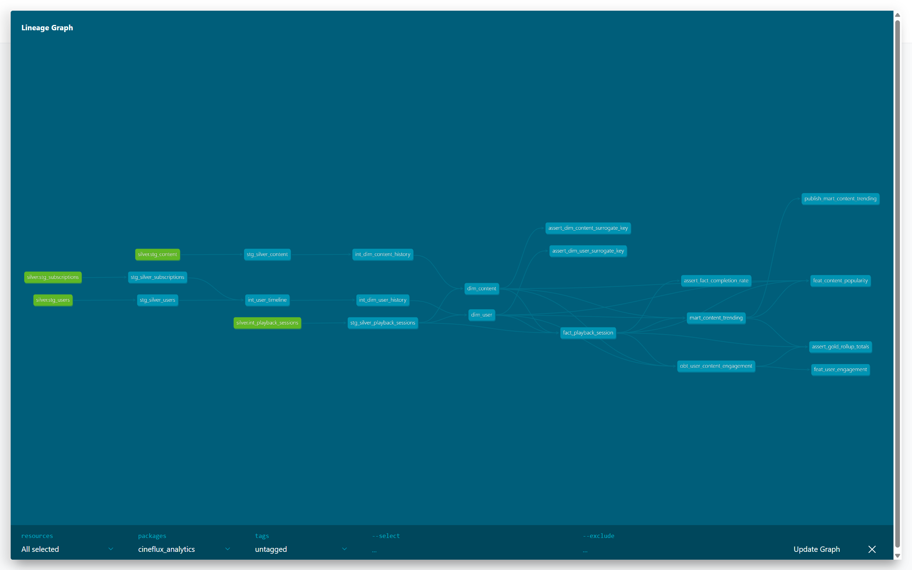
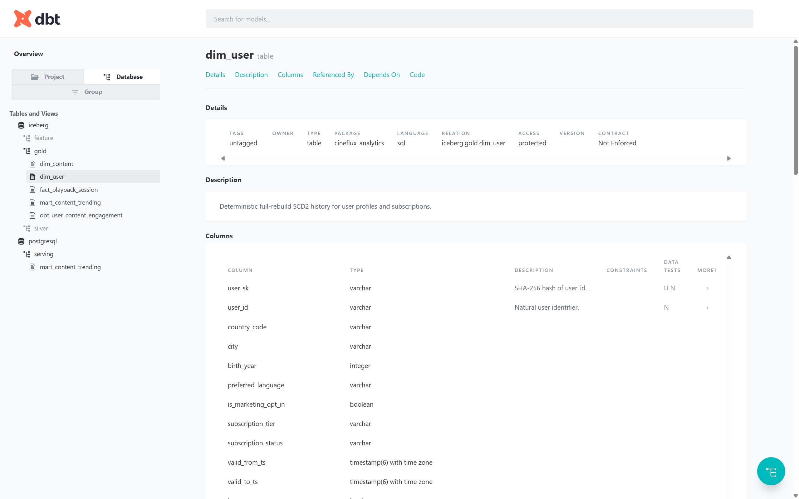
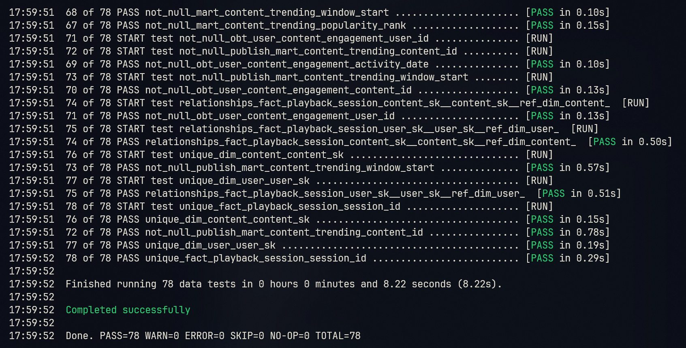
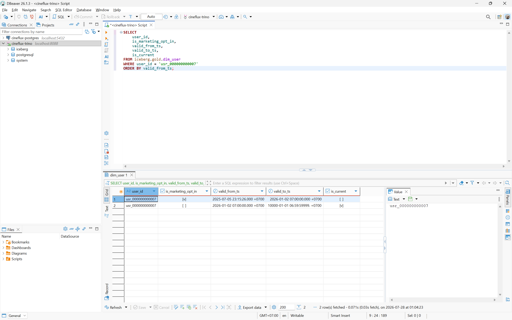

# Novel Ideas

## Rebuildable Analytics And Offline Features With dbt

The analytics layer uses dbt Core with Trino to turn append-only Silver history into
rebuildable Gold models and point-in-time offline features. Iceberg remains the analytical
source of truth, while one selected mart is published through Trino to PostgreSQL for
serving workloads.

```text
iceberg.silver.*
  -> ephemeral staging and history models
  -> iceberg.gold.dim_* / fact_* / obt_* / mart_*
  -> iceberg.feature.feat_*

iceberg.gold.mart_content_trending
  -> postgresql.serving.mart_content_trending
```

### Model Design

| Model | Grain | Build strategy |
|---|---|---|
| `dim_user` | User version | Deterministic SCD2 full rebuild |
| `dim_content` | Content version | Deterministic SCD2 full rebuild |
| `fact_playback_session` | Playback session | Full rebuild with time-valid dimension keys |
| `obt_user_content_engagement` | User, content, activity date | Daily rollup |
| `mart_content_trending` | Content, one-hour window | Hourly ranking |
| `feat_user_engagement` | User, day | Point-in-time rolling features |
| `feat_content_popularity` | Content, hour | Point-in-time rolling features |
| `serving.mart_content_trending` | Content, one-hour window | Incremental delete-and-insert |

SCD2 dimensions are derived from Silver history without snapshots or stateful merges.
Consecutive versions with the same `record_hash` are removed, `lead()` closes each effective
interval, and the surrogate key hashes the natural key with `valid_from_ts`. The first
version is backdated only when historical playback predates the first recurring entity
delivery, allowing every fact row to resolve a time-valid dimension key.

Feature tables contain exactly two timestamp columns: `event_timestamp` and `created`.
Rolling floating-point metrics are normalized to fixed precision so repeated distributed
aggregations produce identical values. The PostgreSQL target uses the primary key
`(window_start, content_id)`, which allows the Trino connector to perform idempotent writes.

### Verified Results

| Relation | Rows |
|---|---:|
| `gold.dim_user` | 117,277 |
| `gold.dim_content` | 27,275 |
| `gold.fact_playback_session` | 1,666,760 |
| `gold.obt_user_content_engagement` | 1,666,757 |
| `gold.mart_content_trending` | 1,651,370 |
| `feature.feat_user_engagement` | 1,592,248 |
| `feature.feat_content_popularity` | 1,651,370 |
| `postgresql.serving.mart_content_trending` | 1,651,370 |

Two consecutive full runs produced the same row counts and checksums. The Iceberg mart and
its PostgreSQL serving copy both produced checksum `CBE13C8F307A6FA5`. The final data-quality
run completed with `78` passing tests and no warnings or errors.

### Reproduce

```bash
make dbt-build
make dbt-up
make dbt-debug
make dbt-smoke
make dbt-run
make dbt-test
make dbt-docs
make dbt-docs-serve
```

Use the following query to show a user with multiple SCD2 versions:

```sql
SELECT
    user_id,
    country_code,
    city,
    birth_year,
    preferred_language,
    is_marketing_opt_in,
    subscription_tier,
    subscription_status,
    valid_from_ts,
    valid_to_ts,
    is_current
FROM iceberg.gold.dim_user
WHERE user_id = 'usr_000000000007'
ORDER BY valid_from_ts;
```

### Evidence



The lineage graph shows Silver sources flowing through staging and history models into Gold,
offline Feature tables, and the PostgreSQL serving model.



The generated `dim_user` page documents its SCD2 purpose, physical relation, columns, and
attached tests.



The final data-quality run passes all 78 tests without warnings, errors, or skipped tests.



The user history preserves both marketing-opt-in states, closes the first interval exactly
where the second begins, and marks only the latest version as current.
