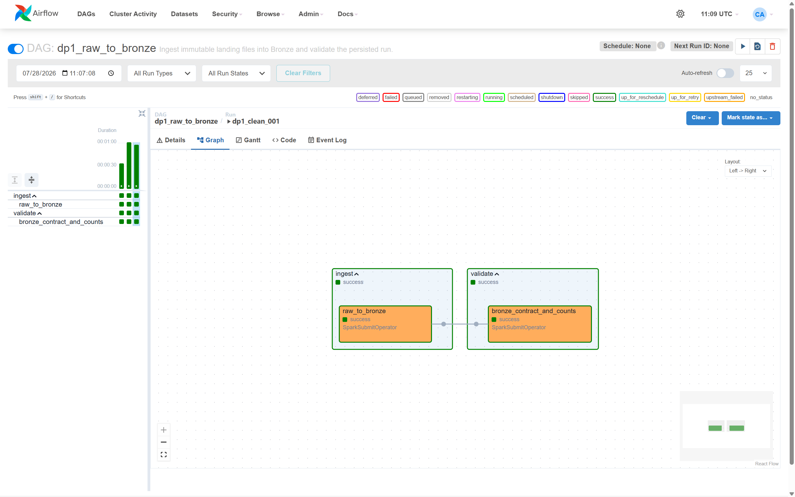
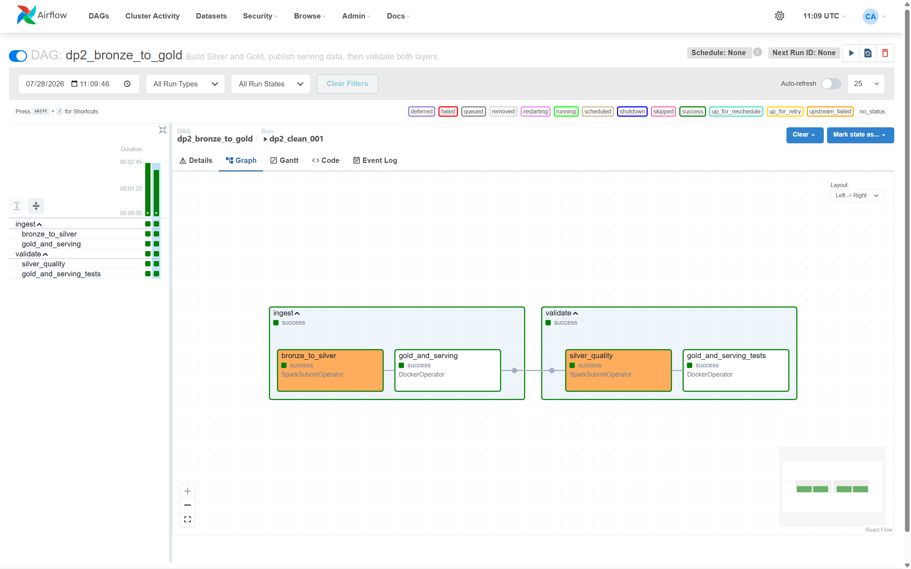
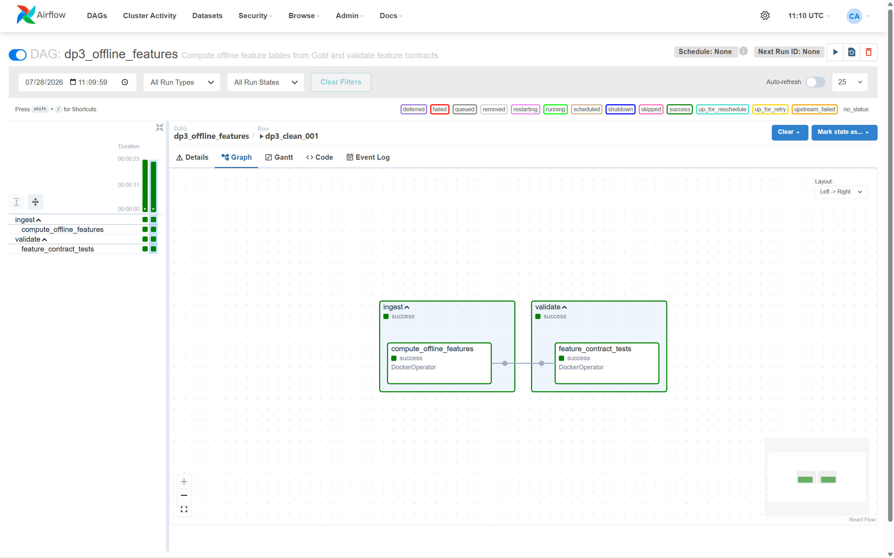
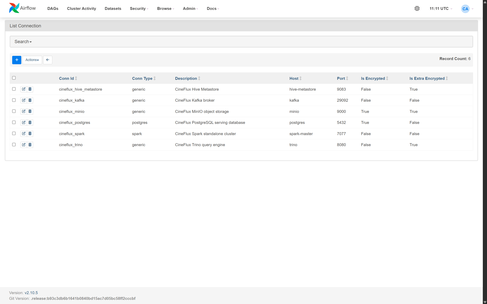

# Pipeline Orchestration

Apache Airflow coordinates the batch data pipelines without embedding transformation logic
inside DAG files. Spark work runs through `SparkSubmitOperator`; dbt work runs in the pinned
optimized dbt image through `DockerOperator`.

## DAGs

| DAG | Task order | Schedule |
|---|---|---|
| `dp1_raw_to_bronze` | `raw_to_bronze` -> `bronze_contract_and_counts` | Manual |
| `dp2_bronze_to_gold` | `bronze_to_silver` -> `gold_and_serving` -> `silver_quality` -> `gold_and_serving_tests` | Manual |
| `dp3_offline_features` | `compute_offline_features` -> `feature_contract_tests` | Manual |
| `iceberg_maintenance` | `compact_small_files` -> `expire_old_snapshots` | Sunday at 03:00 UTC |

Each data pipeline exposes separate `ingest` and `validate` TaskGroups. Retries, layer names,
runtime paths, image names, and service routing are supplied by Airflow configuration rather
than hardcoded in the DAGs.

## Completed Pipelines

### Raw To Bronze



DP1 persists one landing delivery to the four Bronze tables and validates source contracts,
row counts, schema evolution, and the cutover boundary in a separate task.

### Bronze To Gold And Serving



DP2 runs Spark Bronze-to-Silver processing, builds Gold and the PostgreSQL serving copy with
dbt, then executes independent Silver and dbt quality checks.

### Offline Features



DP3 builds the two offline feature tables from Gold and validates their contracts in a
separate dbt task.

## Airflow Connections And Variables

Six Airflow Connections own service endpoints and credentials:

| Connection | Purpose |
|---|---|
| `cineflux_spark` | Spark standalone master |
| `cineflux_minio` | Landing and Iceberg object storage |
| `cineflux_kafka` | Kafka broker routing |
| `cineflux_trino` | dbt query engine |
| `cineflux_postgres` | PostgreSQL serving database |
| `cineflux_hive_metastore` | Iceberg metastore endpoint |



Airflow Variables hold non-secret orchestration settings: retries, schedules, namespace and
bucket names, Spark paths and resources, dbt selectors, Docker routing, and landing prefixes.
The idempotent bootstrap script creates or updates both Connections and Variables from the
local environment.

Inspect the runtime configuration without printing credentials:

```bash
make airflow-connections
make airflow-variables
```

## Validation

The clean end-to-end run produced the following final state:

| Check | Result |
|---|---:|
| Bronze playback rows | 5,102,060 |
| Bronze pipeline runs | 1 |
| Silver playback rows | 5,000,000 |
| Silver playback duplicates | 0 |
| Silver session rows | 1,666,760 |
| Silver session duplicates | 0 |
| Gold trending rows | 1,651,370 |
| User feature rows | 1,592,248 |
| Content feature rows | 1,651,370 |
| PostgreSQL serving rows | 1,651,370 |
| PostgreSQL serving duplicates | 0 |

Retrying the same DP1 task instance reused its completed `_pipeline_run_id` instead of
appending rows. Re-running DP2 preserved the same Silver, Gold, Feature, and serving counts.
The maintenance DAG also completed compaction and snapshot expiration successfully.

## Run

```bash
make airflow-build
make airflow-up
make airflow-import-check
make airflow-connections
make airflow-variables

make airflow-trigger DAG_ID=dp1_raw_to_bronze
make airflow-trigger DAG_ID=dp2_bronze_to_gold
make airflow-trigger DAG_ID=dp3_offline_features
```
