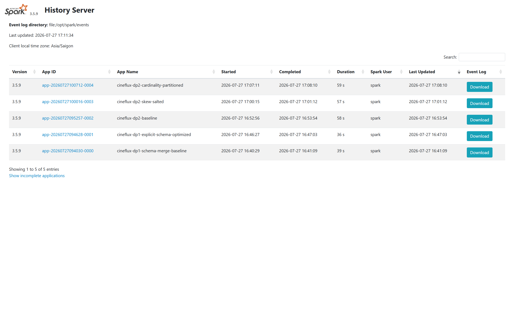
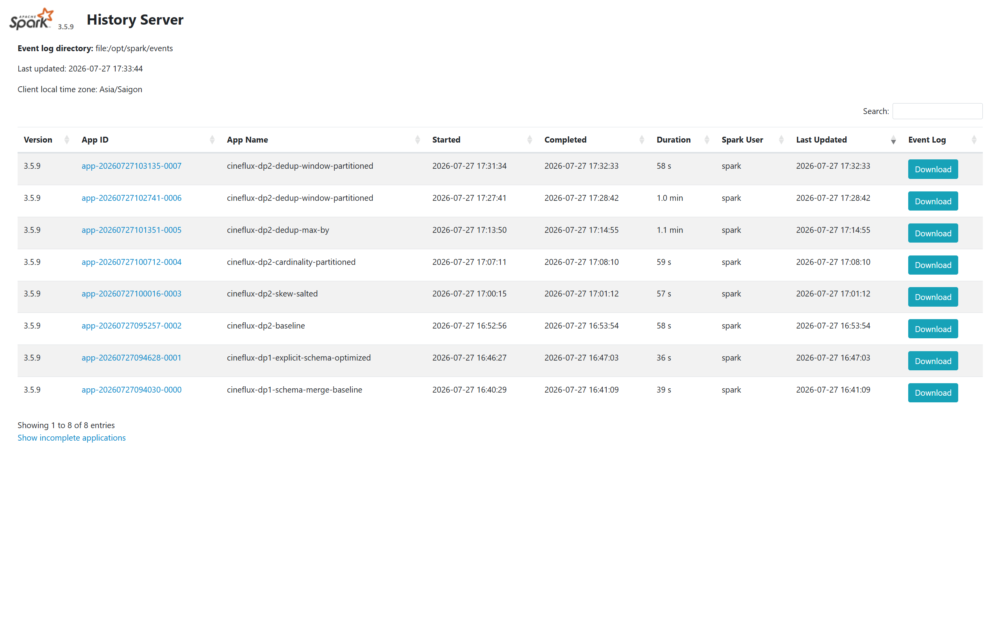
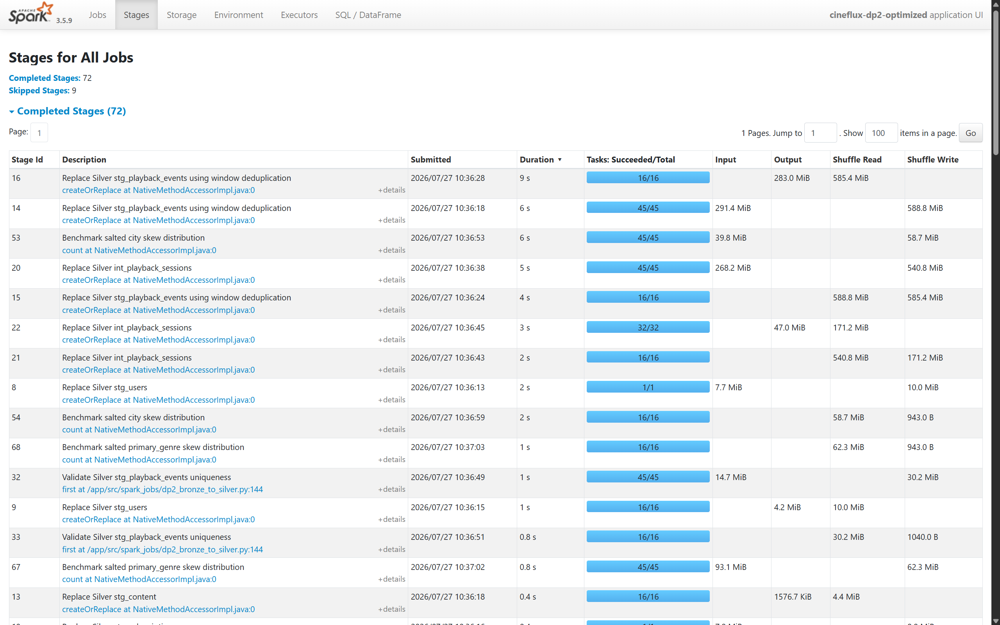
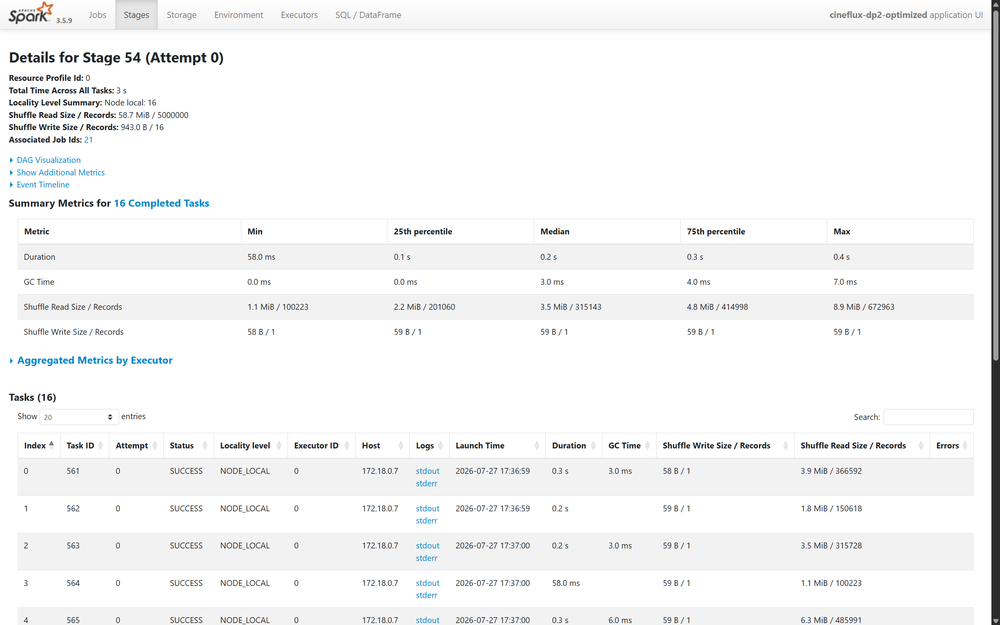

# Processing Jobs

## Spark Batch Processing

Spark owns batch ingestion from the MinIO landing zone through the Silver Iceberg layer.
DP1 appends source versions to Bronze; DP2 rebuilds deterministic Silver tables from the
complete Bronze history.

| Pipeline | Input | Output | Write behavior |
|---|---|---|---|
| DP1 | Landing Parquet files | `bronze.raw_users`, `raw_subscriptions`, `raw_content`, `raw_playback_events` | Append source versions |
| DP2 | Four Bronze tables | `silver.stg_users`, `stg_subscriptions`, `stg_content`, `stg_playback_events`, `int_playback_sessions` | Deterministic table replacement |

The version tables keep one row per `(natural_key, source_updated_timestamp)`. They do not
collapse history to the current record because downstream dimensional models require every
accepted source version.

## Reproduce The Runs

Build the optimized runtime and start the processing dependencies:

```bash
make spark-build
make spark-up
```

Submit a named configuration from the repository root:

```bash
make spark-dp1 \
  SPARK_CONFIG=spark_dp1_optimized \
  PIPELINE_RUN_ID=dp1_schema_optimized_001

make spark-dp2 \
  SPARK_CONFIG=spark_dp2_optimized \
  PIPELINE_RUN_ID=dp2_optimized_001
```

Each submission prints a JSON summary with the Spark application ID, effective
configuration, duration, input/output counts, and quality metrics. Spark History Server is
available at `http://localhost:18080`.

### Versioned Benchmark Configurations

| Configuration | Purpose | Key settings |
|---|---|---|
| [`spark_dp1_baseline.yaml`](../data_platform/spark_jobs/config/spark_dp1_baseline.yaml) | DP1 schema baseline | Schema merge, 8 shuffle partitions |
| [`spark_dp1_optimized.yaml`](../data_platform/spark_jobs/config/spark_dp1_optimized.yaml) | DP1 optimized | Explicit schemas, 8 shuffle partitions |
| [`spark_dp2_baseline.yaml`](../data_platform/spark_jobs/config/spark_dp2_baseline.yaml) | DP2 baseline | 8 global partitions, 2 session partitions, direct skew aggregation |
| [`spark_dp2_skew_optimized.yaml`](../data_platform/spark_jobs/config/spark_dp2_skew_optimized.yaml) | Isolated skew experiment | 16 salt buckets |
| [`spark_dp2_cardinality_optimized.yaml`](../data_platform/spark_jobs/config/spark_dp2_cardinality_optimized.yaml) | Isolated cardinality experiment | 32 session partitions |
| [`spark_dp2_duplicates_optimized.yaml`](../data_platform/spark_jobs/config/spark_dp2_duplicates_optimized.yaml) | Isolated deduplication experiment | 16 global shuffle partitions |
| [`spark_dp2_optimized.yaml`](../data_platform/spark_jobs/config/spark_dp2_optimized.yaml) | Combined optimized run | 16 global, 32 session, salted skew aggregation |

All comparisons used the same 5,102,060 playback input rows and disabled Adaptive Query
Execution and automatic broadcast joins. This keeps the physical differences attributable
to the recorded technique.

## DP1: Schema Evolution

**Problem.** The first content delivery has no `critic_score`; the second delivery adds it.
The baseline asks Spark to merge source schemas during ingestion.

**Spark UI observation.** The baseline completed 17 jobs and 29 stages. Schema discovery and
merge added one job/stage while processing the same files and rows.

**Method.** The optimized run supplies explicit version-aware schemas. Version 1 receives a
typed null `critic_score`; version 2 reads the field directly.

**Result.** Row counts and null semantics stayed identical while JSON runtime improved by
9.09% and Spark History runtime improved by 9.14%.

| Metric | Schema merge baseline | Explicit schema | Change |
|---|---:|---:|---:|
| JSON duration | 38.5008 s | 35.0011 s | -9.09% |
| Spark History duration | 39.449 s | 35.842 s | -9.14% |
| Completed jobs | 17 | 16 | -1 |
| Completed stages | 29 | 28 | -1 |
| Content version 1 null `critic_score` | 25,510 | 25,510 | Unchanged |
| Content version 2 null `critic_score` | 2,536 | 2,536 | Unchanged |
| Cutover violations | 0 | 0 | Unchanged |

| Baseline | Optimized |
|---|---|
|  |  |
| **Figure 1.** Baseline application `app-20260727094030-0000` completed in 39 seconds. | **Figure 2.** Explicit-schema application `app-20260727094628-0001` completed in 36 seconds. |
|  |  |
| **Figure 3.** Baseline stages include the extra schema-merge work. | **Figure 4.** The optimized run removes one job/stage while preserving the same outputs. |

## DP2: Baseline And Correctness

The DP2 baseline uses deterministic window deduplication, eight global shuffle partitions,
two session partitions, and direct aggregation of skewed dimensions.

| Output | Rows | Unique business keys | Result |
|---|---:|---:|---|
| `stg_users` | 110,028 | 110,028 | 10,028 historical versions retained |
| `stg_subscriptions` | 110,130 | 110,130 | 10,130 historical versions retained |
| `stg_content` | 27,478 | 27,478 | 2,478 historical versions retained |
| `stg_playback_events` | 5,000,000 | 5,000,000 | 102,060 duplicate input rows removed |
| `int_playback_sessions` | 1,666,760 | 1,666,760 | No duplicate session grain |

Completion rates stayed within `0.0`-`1.0`, and every run reported zero invalid completion
rates.

| Application | Stages sorted by duration |
|---|---|
|  |  |
| **Figure 5.** Baseline application `app-20260727095257-0002` completed in 58 seconds. | **Figure 6.** The stage list exposes the large dedup shuffle, two-task session write, and direct skew benchmarks. |

## Skew Optimization

**Problem.** Ho Chi Minh City owns 44.8648% of playback rows; Drama owns 29.8353%.

**Spark UI observation.** Direct partitioning produced empty reducers and hot tasks. The
largest city task processed 2,243,238 records, while the largest genre task processed
1,491,765 records.

**Method.** A deterministic hash salt spreads each category across 16 salt buckets. The
second aggregation removes the salt and restores the original category totals.

**Result.** The isolated salted run retained identical category counts and reduced the
largest task without changing unrelated DP2 settings.

| Metric | Direct baseline | Salted | Change |
|---|---:|---:|---:|
| City maximum records/task | 2,243,238 | 1,158,954 | -48.3% |
| City maximum task duration | 953 ms | 661 ms | -30.6% |
| Genre maximum records/task | 1,491,765 | 995,262 | -33.3% |
| Genre maximum task duration | 676 ms | 592 ms | -12.4% |
| Empty reducers | Present | None | Removed |
| Full JSON duration | 56.8125 s | 56.0970 s | -1.26% |


**Figure 7.** The optimized application labels both salted benchmarks and keeps their job
groups traceable in Spark History Server.

| Direct city | Salted city |
|---|---|
|  |  |
| **Figure 8.** Direct city partitioning includes empty reducers and a 2.24M-record hot task. | **Figure 9.** Salting distributes every reducer and cuts the largest task to 1.16M records. |

| Direct genre | Salted genre |
|---|---|
|  |  |
| **Figure 10.** Direct genre partitioning leaves reducers empty. | **Figure 11.** Salted genre partitions all receive data and the largest task falls below 1M records. |

## High-Cardinality Session Optimization

**Problem.** Five million deduplicated events form 1,666,760 distinct sessions.

**Spark UI observation.** The baseline writes session output with only two tasks. Each task
reads about 2.5 million records and 80.5 MiB from shuffle.

**Method.** The session aggregation explicitly repartitions by `session_id` into 32
partitions before grouping.

**Result.** Maximum records and shuffle bytes per task fell by more than 93%. The local
single-executor application became 1.92% slower because scheduling and file overhead exceed
the available parallelism; the technique is retained to bound task size and scale across
additional executors.

| Metric | 2 partitions | 32 partitions | Change |
|---|---:|---:|---:|
| Maximum records/task | 2,501,123 | 157,891 | -93.7% |
| Maximum shuffle read/task | 80.5 MiB | 5.2 MiB | -93.5% |
| Maximum task duration | 2,774 ms | 505 ms | -81.8% |
| Full JSON duration | 56.8125 s | 57.9043 s | +1.92% |

| Baseline | Partitioned sessions |
|---|---|
|  |  |
| **Figure 12.** The baseline concentrates five million records in two tasks. | **Figure 13.** The optimized stage distributes the same records across 32 bounded tasks. |



**Figure 14.** The isolated cardinality run records the local-runtime trade-off separately
from the task-size improvement.

## Duplicate And Spill Optimization

**Problem.** Window deduplication of 5,102,060 input rows spills while selecting the newest
record for each `event_id`.

**Spark UI observation.** With eight partitions, Stage 15 spilled 1,600 MiB in memory and
553.8 MiB to disk.

**Method.** The selected configuration keeps deterministic window ordering and raises the
global shuffle count to 16. A `max_by` experiment was rejected because its aggregation state
increased shuffle and spill; 32 window partitions removed spill but added unnecessary local
scheduling overhead.

| Experiment | JSON duration | Memory spill | Decision |
|---|---:|---:|---|
| Window, 8 partitions | 56.8125 s | 1.68 GB | Baseline |
| `max_by`, 8 partitions | 64.2269 s | 3.49 GB | Rejected |
| Window, 32 partitions | 59.7198 s | 0 | Rejected: over-partitioned locally |
| Window, 16 partitions | 57.4884 s | 0 | Selected |

The selected Stage 15 wall time improved from 4.868 seconds to 4.047 seconds (-16.9%), and
the complete dedup write improved from 19.959 seconds to 19.267 seconds (-3.47%).

| Baseline spill | Selected zero-spill run |
|---|---|
|  |  |
| **Figure 15.** Eight large tasks spill to memory and disk. | **Figure 16.** Sixteen smaller tasks complete without spill. |



**Figure 17.** The selected tuning run is retained separately from the rejected experiments.

## Combined Optimized Run

The combined configuration applies explicit DP1 schemas, 16 global DP2 shuffle partitions,
32 session partitions, and salted skew aggregation.

| Metric | DP2 baseline | Combined optimized | Change |
|---|---:|---:|---:|
| JSON duration | 56.8125 s | 55.8199 s | -1.75% |
| Spark History duration | 57.718 s | 56.680 s | -1.80% |
| Dedup memory spill | 1.68 GB | 0 | Removed |
| Dedup disk spill | 580.7 MB | 0 | Removed |
| Session output tasks | 2 | 32 | 16x distribution |
| City maximum records/task | 2,243,238 | 672,963 | -70.0% |
| Genre maximum records/task | 1,491,765 | 633,264 | -57.5% |

| Baseline application | Combined optimized application |
|---|---|
|  |  |
| **Figure 18.** Baseline runtime is 58 seconds in Spark History Server. | **Figure 19.** The combined run completes in 57 seconds with all targeted controls enabled. |



**Figure 20.** The final stage list shows the 16-task dedup stages, 32-task session stage,
and both salted skew benchmarks in one application.

| Zero-spill dedup | Distributed sessions |
|---|---|
|  |  |
| **Figure 21.** Deduplication completes with 16 tasks and no spill. | **Figure 22.** Session output uses 32 tasks with about 156K records per task. |

| Salted city | Salted genre |
|---|---|
|  |  |
| **Figure 23.** City tasks contain 100K-673K records with no empty reducer. | **Figure 24.** Genre tasks contain 92K-633K records with no empty reducer. |

## Idempotency And Trino Validation

Running the combined configuration again with the same Bronze input produced exactly the
same Silver row counts, business-key counts, retained-version counts, and zero duplicates.
The second JSON run completed in 55.7705 seconds, a 0.09% runtime variation from the first
run.

| Metric | First run | Repeated run |
|---|---:|---:|
| Pipeline run ID | `dp2_optimized_001` | `dp2_optimized_002` |
| Spark application | `app-20260727103609-0008` | `app-20260727104248-0009` |
| JSON duration | 55.8199 s | 55.7705 s |
| Staged users | 110,028 | 110,028 |
| Staged subscriptions | 110,130 | 110,130 |
| Staged content | 27,478 | 27,478 |
| Staged playback events | 5,000,000 | 5,000,000 |
| Playback sessions | 1,666,760 | 1,666,760 |
| Duplicate business keys | 0 | 0 |

Trino independently confirmed the physical Iceberg tables:

| Table | Rows | Validation |
|---|---:|---|
| `bronze.raw_users` | 204,080 | DP1 input retained |
| `bronze.raw_subscriptions` | 204,080 | DP1 input retained |
| `bronze.raw_content` | 51,020 | Both schema versions retained |
| `bronze.raw_playback_events` | 5,102,060 | Source duplicates retained |
| `silver.stg_users` | 110,028 | 100,000 natural keys; 110,028 unique version keys |
| `silver.stg_subscriptions` | 110,130 | 100,000 natural keys; 110,130 unique version keys |
| `silver.stg_content` | 27,478 | 25,000 natural keys; 27,478 unique version keys |
| `silver.stg_playback_events` | 5,000,000 | 5,000,000 unique `event_id`; zero duplicates |
| `silver.int_playback_sessions` | 1,666,760 | 1,666,760 unique `session_id`; zero duplicates |

Reproduce catalog and count checks with:

```bash
docker compose exec -T trino trino --execute \
  "SHOW TABLES FROM iceberg.silver"

docker compose exec -T trino trino --execute \
  "SELECT count(*) AS rows, count(DISTINCT event_id) AS unique_events
   FROM iceberg.silver.stg_playback_events"

docker compose exec -T trino trino --execute \
  "SELECT count(*) AS rows,
          count(DISTINCT ROW(user_id, source_updated_timestamp)) AS version_keys
   FROM iceberg.silver.stg_users"
```
