# Processing Jobs

## Spark Batch Processing

Spark ingests landing data into Bronze and builds deterministic Silver tables.

| Pipeline | Input | Output | Write behavior |
|---|---|---|---|
| DP1 | Landing Parquet files | Four `bronze.raw_*` tables | Append source versions |
| DP2 | Four Bronze tables | Four `silver.stg_*` tables and `silver.int_playback_sessions` | Replace deterministic results |

Versioned tables retain one row per `(natural_key, source_updated_timestamp)` for downstream
historical modeling.

### Run

```bash
make spark-build
make spark-up

make spark-dp1 \
  SPARK_CONFIG=spark_dp1_optimized \
  PIPELINE_RUN_ID=dp1_schema_optimized_001

make spark-dp2 \
  SPARK_CONFIG=spark_dp2_optimized \
  PIPELINE_RUN_ID=dp2_optimized_001
```

Spark History Server is available at `http://localhost:18080`. Each run prints its effective
configuration, duration, row counts, quality metrics, and Spark application ID.

| Configuration | Purpose | Key settings |
|---|---|---|
| [`spark_dp1_baseline.yaml`](../data_platform/spark_jobs/config/spark_dp1_baseline.yaml) | DP1 baseline | Schema merge, 8 shuffle partitions |
| [`spark_dp1_optimized.yaml`](../data_platform/spark_jobs/config/spark_dp1_optimized.yaml) | DP1 optimized | Explicit schemas, 8 shuffle partitions |
| [`spark_dp2_baseline.yaml`](../data_platform/spark_jobs/config/spark_dp2_baseline.yaml) | DP2 baseline | 8 global partitions, 2 session partitions, direct aggregation |
| [`spark_dp2_skew_optimized.yaml`](../data_platform/spark_jobs/config/spark_dp2_skew_optimized.yaml) | Skew optimization | 16 salt buckets |
| [`spark_dp2_cardinality_optimized.yaml`](../data_platform/spark_jobs/config/spark_dp2_cardinality_optimized.yaml) | Cardinality optimization | 32 session partitions |
| [`spark_dp2_duplicates_optimized.yaml`](../data_platform/spark_jobs/config/spark_dp2_duplicates_optimized.yaml) | Deduplication optimization | 16 global shuffle partitions |
| [`spark_dp2_optimized.yaml`](../data_platform/spark_jobs/config/spark_dp2_optimized.yaml) | Combined optimized run | 16 global partitions, 32 session partitions, salted aggregation |

All comparisons use the same 5,102,060 playback input rows with Adaptive Query Execution and
automatic broadcast joins disabled.

## DP1: Schema Evolution

**Problem.** Content schema version 2 adds `critic_score`; the baseline merges source schemas.

**Observation.** Schema merging adds one job and one stage.

**Change.** Explicit version-aware schemas assign a typed null to the version 1 field.

**Result.** Output semantics are unchanged and duration decreases by 9.09%.

| Metric | Baseline | Optimized | Change |
|---|---:|---:|---:|
| Duration | 38.5008 s | 35.0011 s | -9.09% |
| Completed jobs | 17 | 16 | -1 |
| Completed stages | 29 | 28 | -1 |
| Version 1 null `critic_score` | 25,510 | 25,510 | Unchanged |
| Version 2 null `critic_score` | 2,536 | 2,536 | Unchanged |
| Cutover violations | 0 | 0 | Unchanged |

| Baseline | Optimized |
|---|---|
| 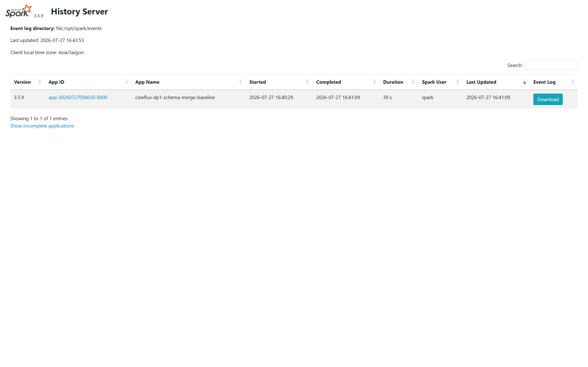 | 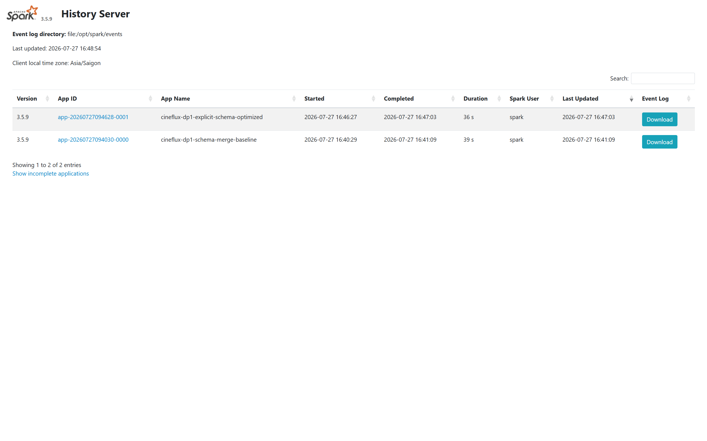 |
| 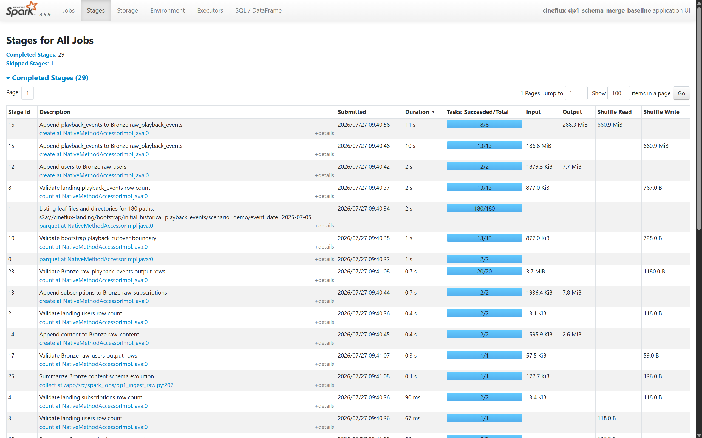 | 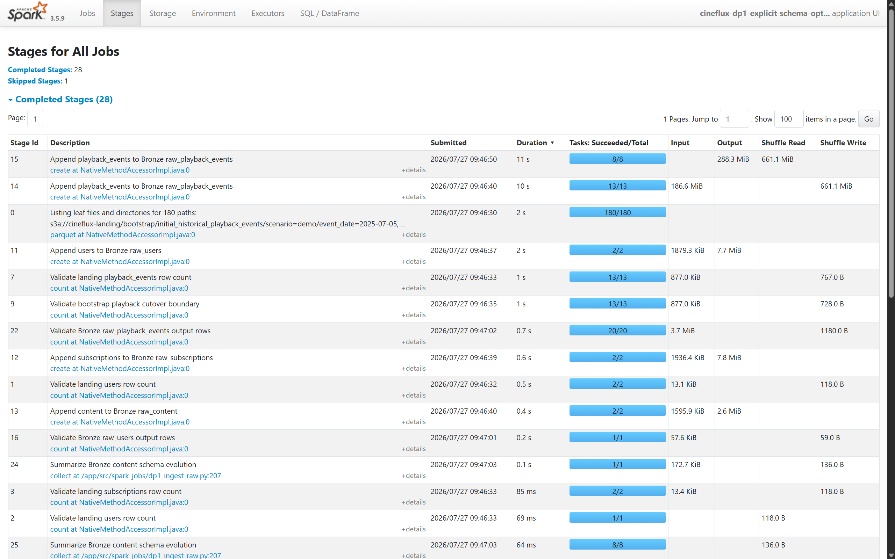 |

## DP2: Correctness

| Output | Rows | Unique business keys | Validation |
|---|---:|---:|---|
| `stg_users` | 110,028 | 110,028 | 10,028 extra versions retained |
| `stg_subscriptions` | 110,130 | 110,130 | 10,130 extra versions retained |
| `stg_content` | 27,478 | 27,478 | 2,478 extra versions retained |
| `stg_playback_events` | 5,000,000 | 5,000,000 | 102,060 duplicates removed |
| `int_playback_sessions` | 1,666,760 | 1,666,760 | No duplicate session grain |

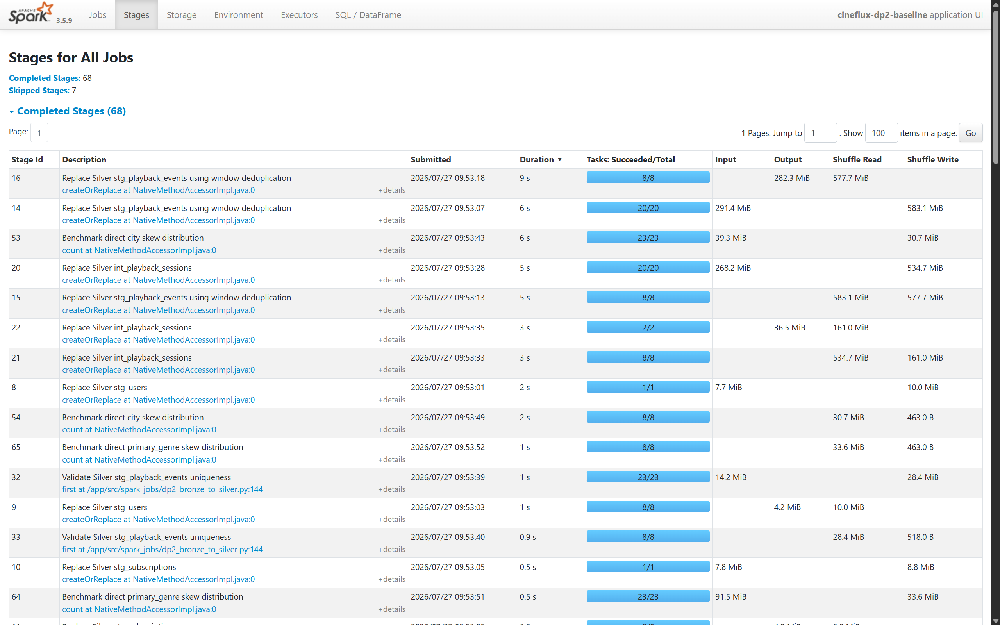

## Skew Optimization

**Problem.** Ho Chi Minh City contains 44.8648% of playback rows; Drama contains 29.8353%.

**Observation.** Direct aggregation creates empty reducers and hot tasks.

**Change.** Deterministic salting distributes each category across 16 buckets before the final
aggregation.

**Result.** Category totals remain unchanged while the largest tasks become smaller and faster.

| Metric | Baseline | Optimized | Change |
|---|---:|---:|---:|
| Duration | 56.8125 s | 56.0970 s | -1.26% |
| City maximum records/task | 2,243,238 | 1,158,954 | -48.3% |
| City maximum task duration | 953 ms | 661 ms | -30.6% |
| Genre maximum records/task | 1,491,765 | 995,262 | -33.3% |
| Genre maximum task duration | 676 ms | 592 ms | -12.4% |
| Empty reducers | Present | None | Removed |

| Baseline city | Optimized city |
|---|---|
| 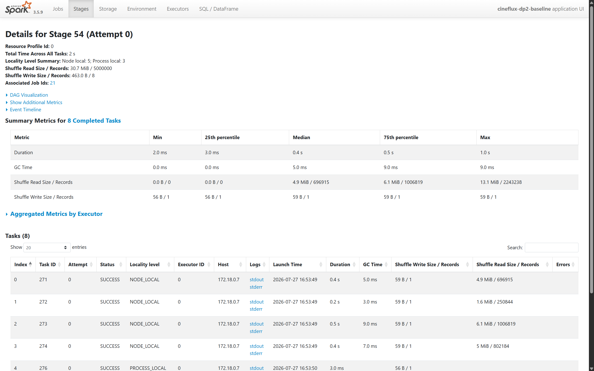 | 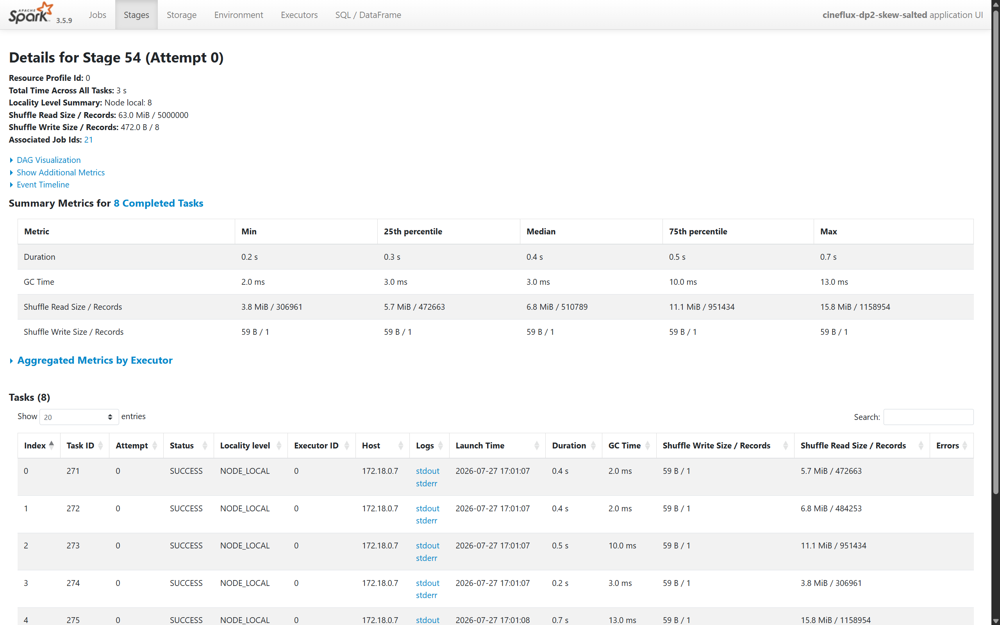 |

| Baseline genre | Optimized genre |
|---|---|
| 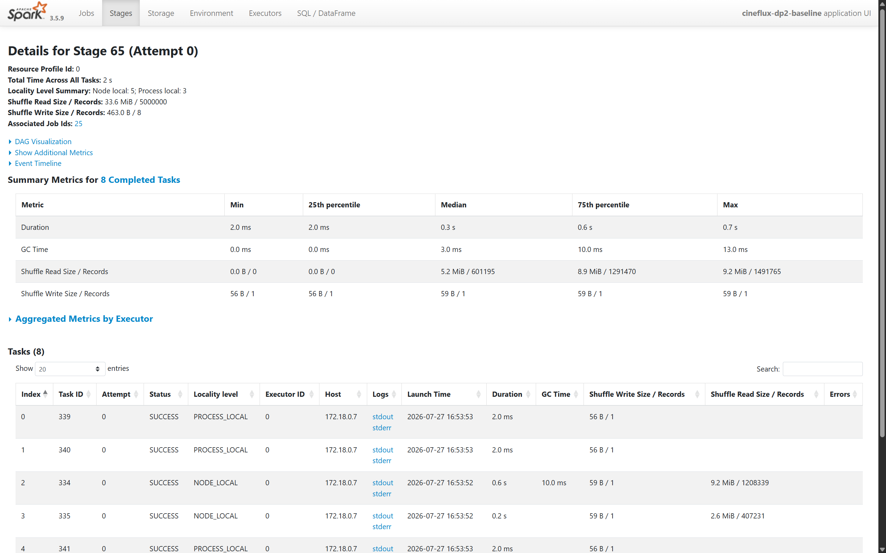 |  |

## High-Cardinality Optimization

**Problem.** Five million events form 1,666,760 distinct sessions.

**Observation.** Two output tasks each process about 2.5 million records and 80.5 MiB of shuffle.

**Change.** Session data is repartitioned by `session_id` into 32 partitions before aggregation.

**Result.** Maximum per-task load decreases by more than 93%. Total duration increases by 1.92%
on one local executor, trading minor scheduling overhead for bounded task size.

| Metric | Baseline | Optimized | Change |
|---|---:|---:|---:|
| Duration | 56.8125 s | 57.9043 s | +1.92% |
| Maximum records/task | 2,501,123 | 157,891 | -93.7% |
| Maximum shuffle read/task | 80.5 MiB | 5.2 MiB | -93.5% |
| Maximum task duration | 2,774 ms | 505 ms | -81.8% |

| Baseline | Optimized |
|---|---|
| 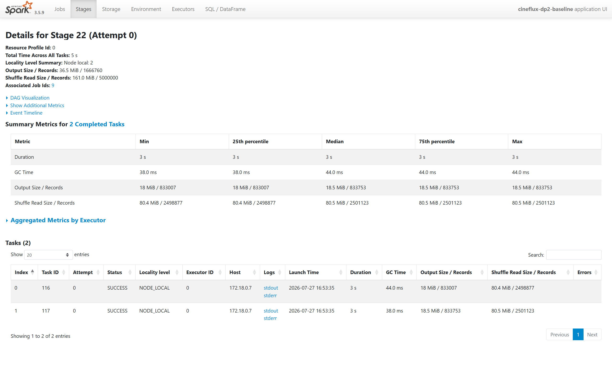 |  |

## Duplicate Optimization

**Problem.** Deduplicating 5,102,060 rows by `event_id` spills with eight shuffle partitions.

**Observation.** The baseline spills 1,600 MiB to memory and 553.8 MiB to disk.

**Change.** Deterministic window deduplication uses 16 global shuffle partitions.

**Result.** Spill is removed and the dedup stage duration decreases by 16.9%.

| Metric | Baseline | Optimized | Change |
|---|---:|---:|---:|
| Duration | 56.8125 s | 57.4884 s | +1.19% |
| Memory spill | 1,600 MiB | 0 | Removed |
| Disk spill | 553.8 MiB | 0 | Removed |
| Dedup stage duration | 4.868 s | 4.047 s | -16.9% |

| Baseline | Optimized |
|---|---|
| 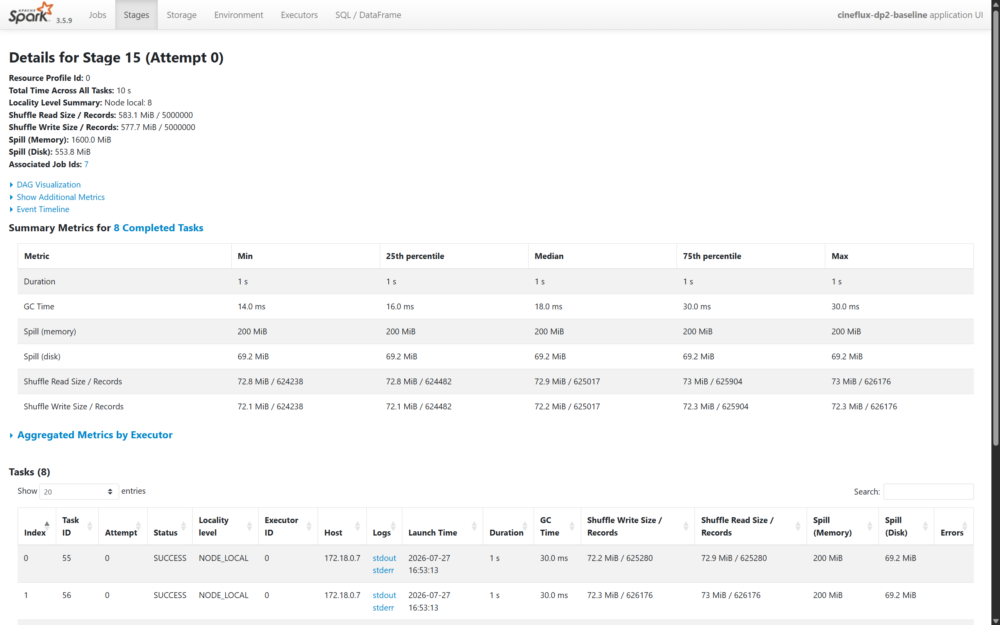 | 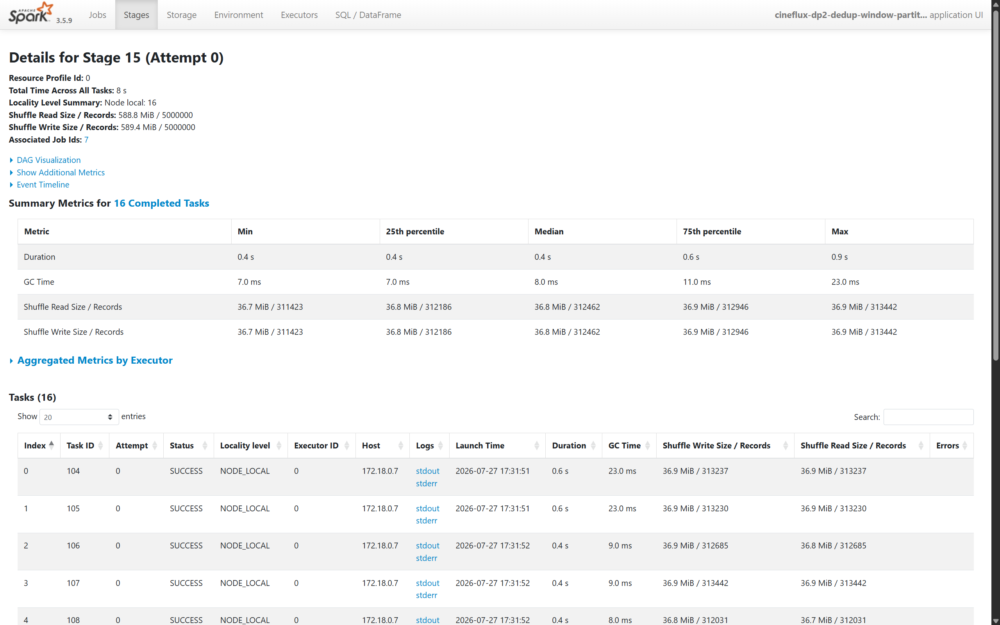 |

## Combined Result

The final configuration combines 16 global shuffle partitions, 32 session partitions, and
salted aggregation.

| Metric | Baseline | Optimized | Change |
|---|---:|---:|---:|
| Duration | 56.8125 s | 55.8199 s | -1.75% |
| Dedup memory spill | 1.68 GB | 0 | Removed |
| Dedup disk spill | 580.7 MB | 0 | Removed |
| Session output tasks | 2 | 32 | 16x distribution |
| City maximum records/task | 2,243,238 | 672,963 | -70.0% |
| Genre maximum records/task | 1,491,765 | 633,264 | -57.5% |

| Baseline | Optimized |
|---|---|
| 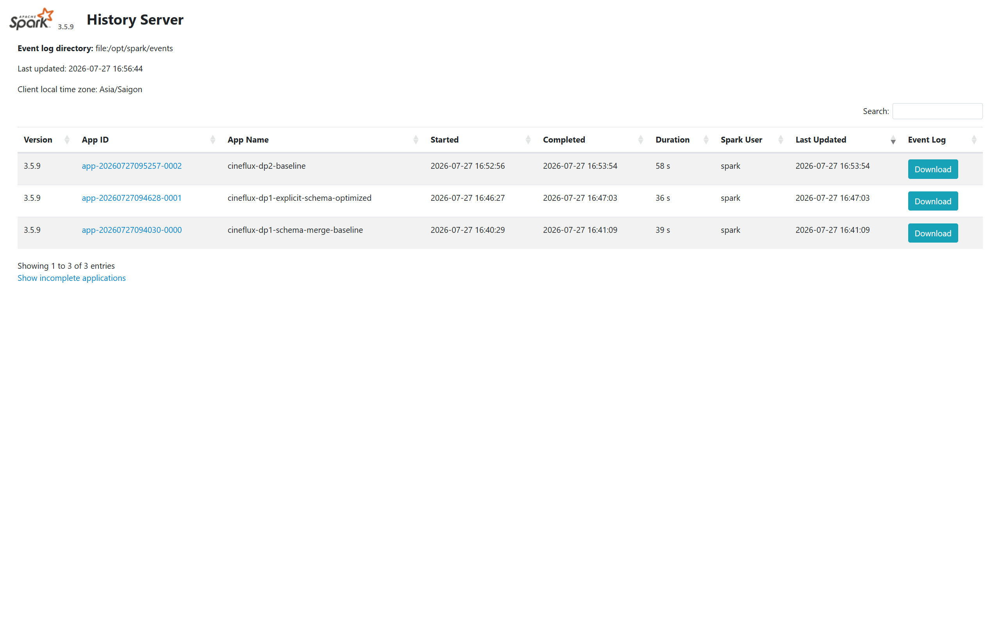 | 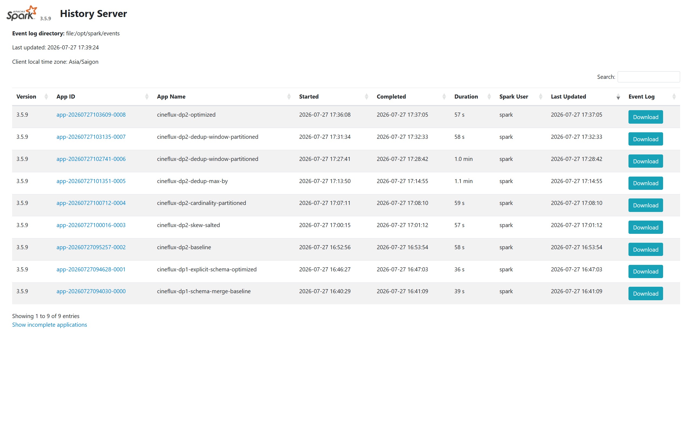 |
|  | 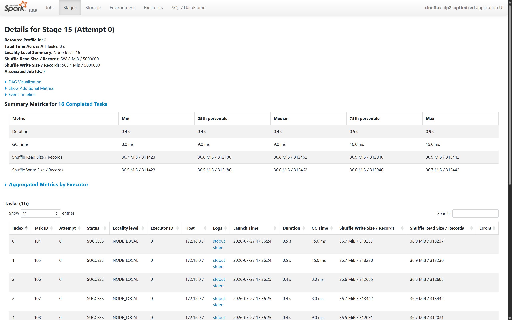 |
|  | 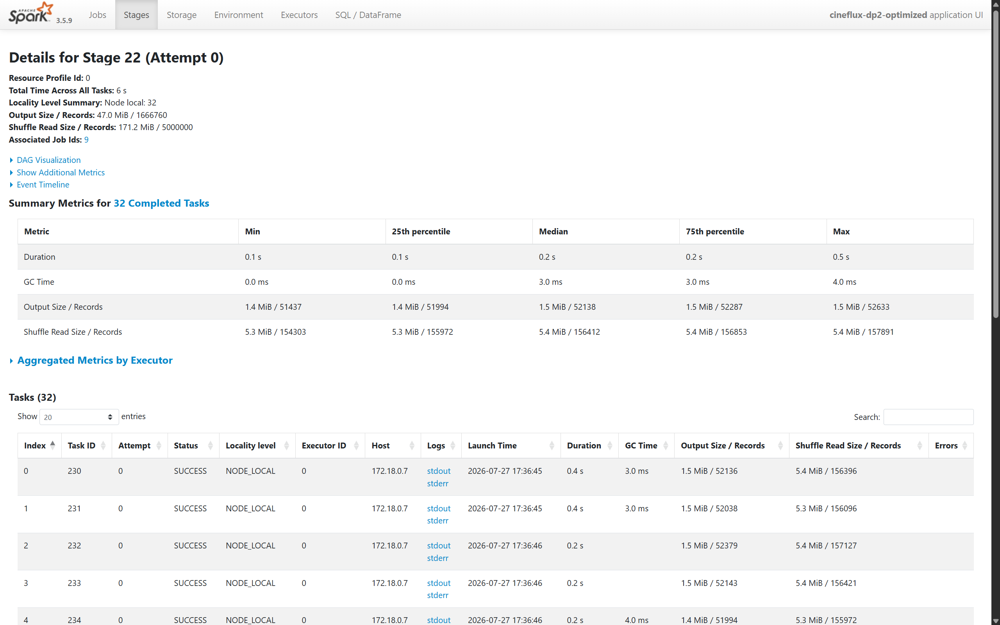 |

## Idempotency And Trino Validation

A repeated optimized run produced identical Silver counts and zero duplicate business keys.

| Output | First run | Repeated run |
|---|---:|---:|
| `stg_users` | 110,028 | 110,028 |
| `stg_subscriptions` | 110,130 | 110,130 |
| `stg_content` | 27,478 | 27,478 |
| `stg_playback_events` | 5,000,000 | 5,000,000 |
| `int_playback_sessions` | 1,666,760 | 1,666,760 |
| Duplicate business keys | 0 | 0 |

Trino confirmed the same physical Iceberg table counts. Reproduce the key checks with:

```bash
docker compose exec -T trino trino --execute \
  "SELECT count(*) AS rows, count(DISTINCT event_id) AS unique_events
   FROM iceberg.silver.stg_playback_events"

docker compose exec -T trino trino --execute \
  "SELECT count(*) AS rows,
          count(DISTINCT ROW(user_id, source_updated_timestamp)) AS version_keys
   FROM iceberg.silver.stg_users"
```

## Flink Streaming Processing

Flink reads Confluent-wire Avro records from Kafka, validates the contract, applies
event-time controls, and writes five-minute PostgreSQL aggregates. Invalid records are sent
to a replay-ready Kafka DLQ.

```text
Kafka playback_events
-> contract validation and DLQ routing
-> watermark, late-event handling, and event-id deduplication
-> five-minute event-time windows
-> PostgreSQL streaming.*
```

### Run

```bash
make flink-build
make flink-up
make flink-migrate
make flink-submit FLINK_CONFIG=flink_optimized
make generator-stream GENERATOR_CONFIG=flink_demo EXECUTION_ID=flink_optimized_001
```

Each benchmark uses a separate consumer group and versioned YAML configuration. Cancel the
job and reset its Kafka and PostgreSQL data before repeating a run:

```bash
make flink-cancel FLINK_JOB_ID=<job-id>
make flink-reset-data FLINK_CONFIG=flink_optimized
```

### Baseline And Burst Optimization

**Problem.** The baseline used one task, row-level JDBC flushing, aligned checkpoints, and
no late-event or duplicate filtering. The burst run increased operator parallelism to six,
buffered JDBC writes, and enabled unaligned checkpoints.

| Metric | Baseline | Burst optimized |
|---|---:|---:|
| Parallelism | 1 | 6 |
| Backpressure | 3% | 0% |
| Checkpoint maximum | 2.465 s | 1.127 s |
| Kafka consumer lag | 61,114 | 0 after drain |
| Approximately 310K records | 3m40s | 1m12s |

| Baseline | Burst optimized |
|---|---|
| 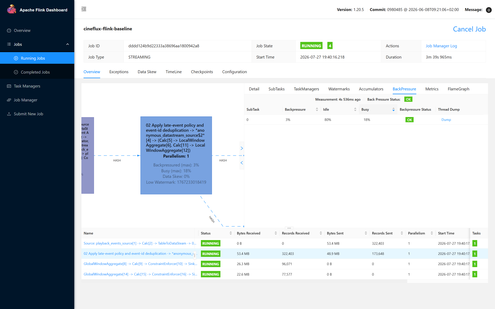 | 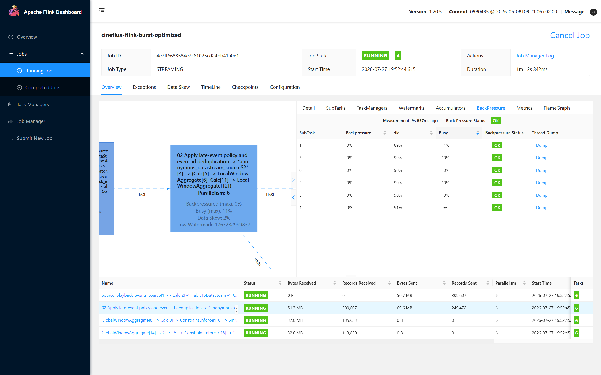 |
|  | 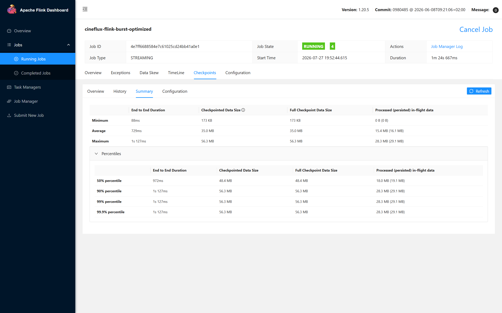 |
| 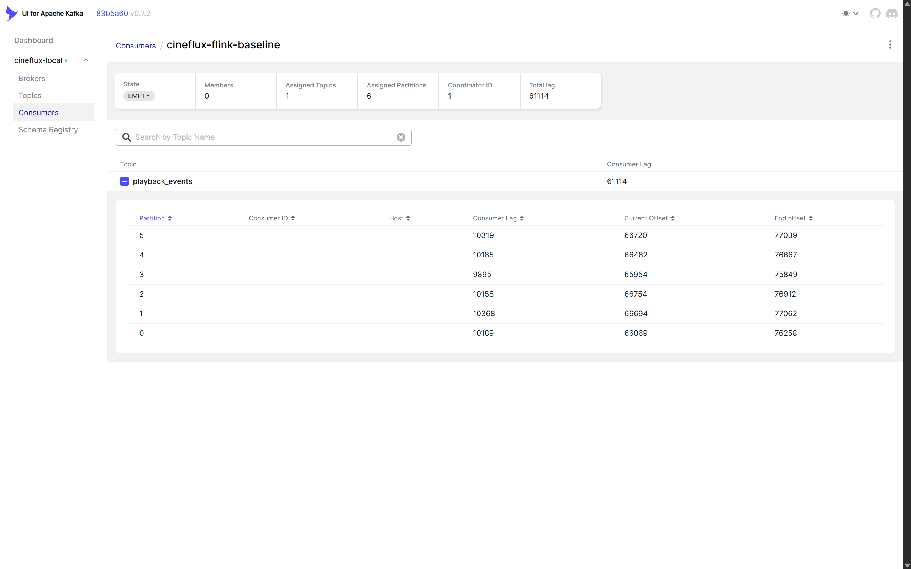 | 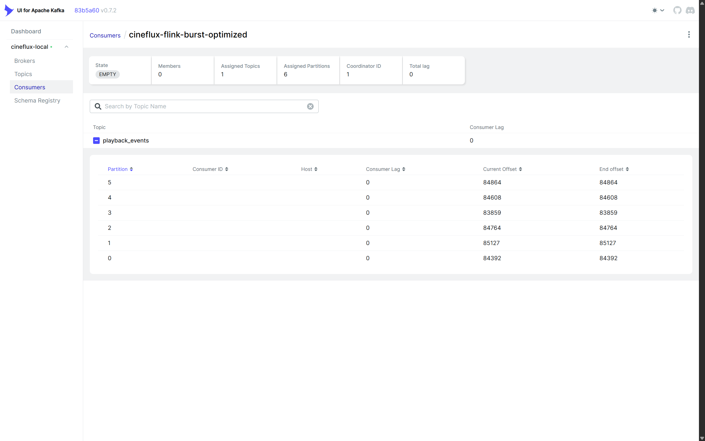 |

Configurations: [`flink_baseline.yaml`](../data_platform/flink_jobs/config/flink_baseline.yaml)
and [`flink_burst_optimized.yaml`](../data_platform/flink_jobs/config/flink_burst_optimized.yaml).

### Late Arrivals

**Problem.** The stream config marks 5% of base events as 15-60 minutes late. The optimized
job applies a 30-second production-time watermark and drops events whose payload event time
is already behind that watermark.

**Result.** Flink counted 24,202 dropped late events, or 4.84% of the 500,000 base events.

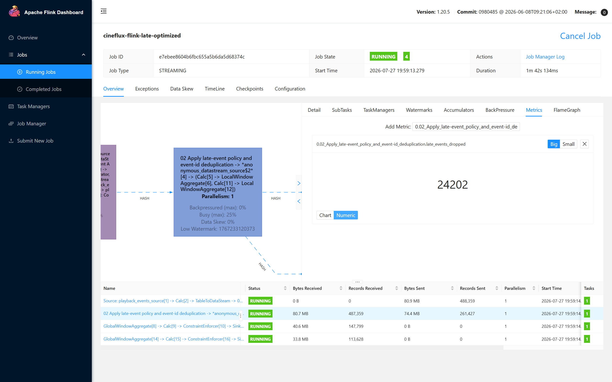

Configuration: [`flink_late_optimized.yaml`](../data_platform/flink_jobs/config/flink_late_optimized.yaml).

### Duplicate Events

**Problem.** Retry simulation repeats approximately 1.5% of event IDs. The optimized job
keys records by `event_id` and stores seen IDs in checkpointed state with a 90-minute TTL.

**Result.** At the capture point, Flink dropped 4,733 duplicates from 314,712 records, an
observed rate of 1.504%.

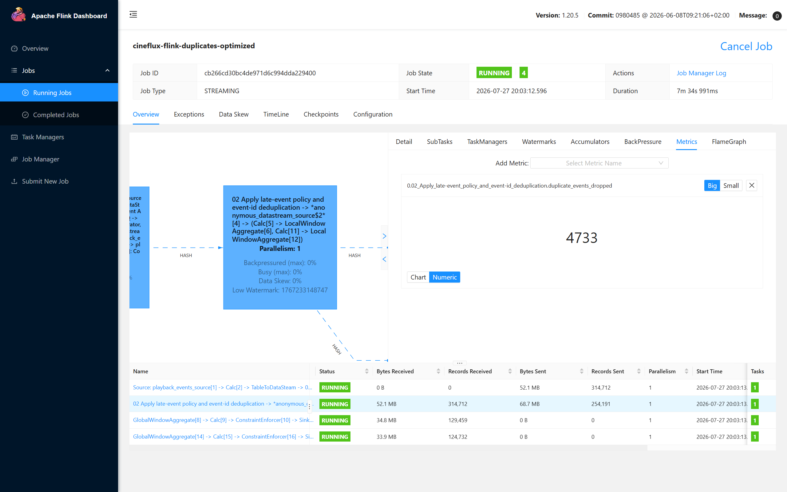

Configuration: [`flink_duplicates_optimized.yaml`](../data_platform/flink_jobs/config/flink_duplicates_optimized.yaml).

### Windows, DLQ, And Recovery

The final configuration combines parallelism, buffered sinks, a 30-second watermark,
event-ID state, incremental RocksDB checkpoints, and MinIO checkpoint storage. Flink Table
API uses configurable five-minute `TUMBLE` windows over `event_time` for both outputs; the
implementation is in [`pipeline.py`](../data_platform/flink_jobs/src/flink_jobs/pipeline.py).

PostgreSQL primary keys enforce idempotent upserts:

| Table | Rows | Duplicate primary keys |
|---|---:|---:|
| `streaming.playback_metrics_5m` | 8,501 | 0 |
| `streaming.content_popularity_5m` | 7,553 | 0 |

Malformed records are encoded with the dedicated DLQ Avro contract. The captured run showed
558 messages in `playback_events_dlq`, including the original payload, error details, source
metadata, and replay count.

| DLQ topic | Decoded DLQ message |
|---|---|
| 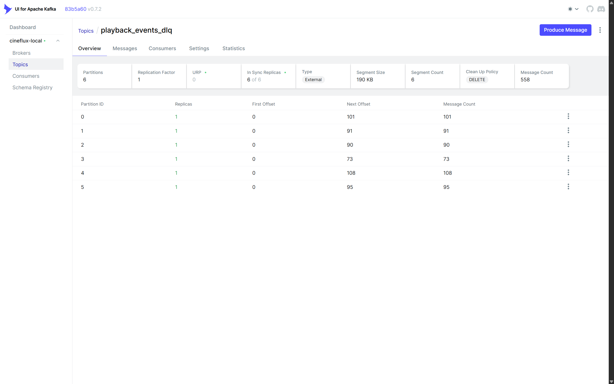 | 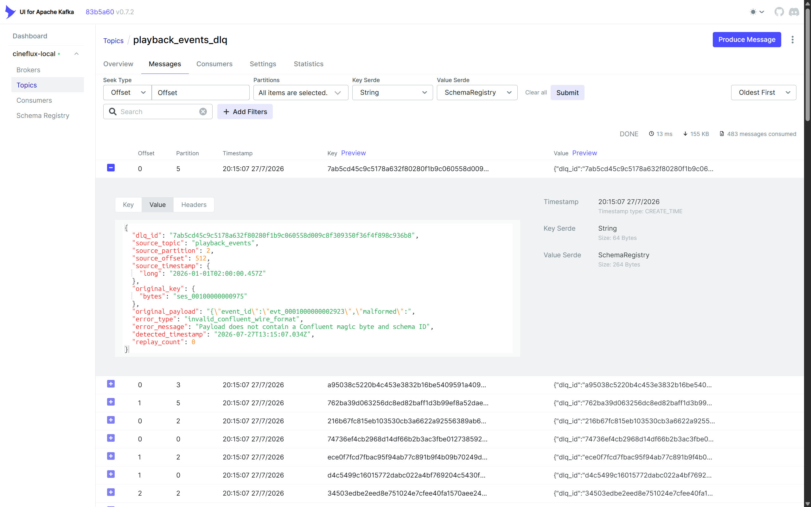 |

Restarting the TaskManager preserved the same Job ID
`cbf39a16e9becae4ff87f36a0d19c446`. The job returned to `RUNNING`, reported `Restored: 1`,
and restored checkpoint `chk-7` from MinIO.

| Job after recovery | Restored checkpoint |
|---|---|
| 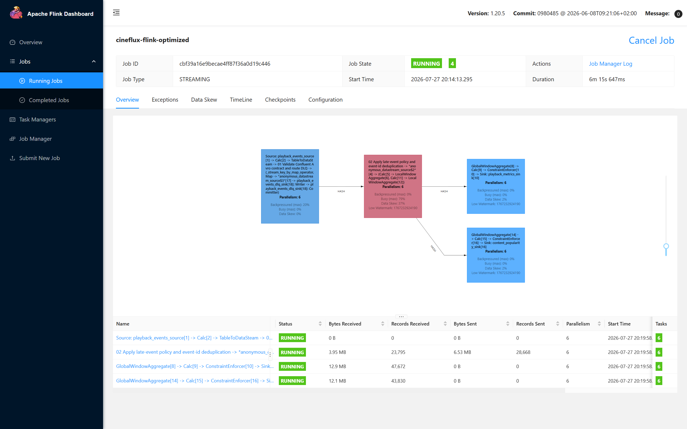 | 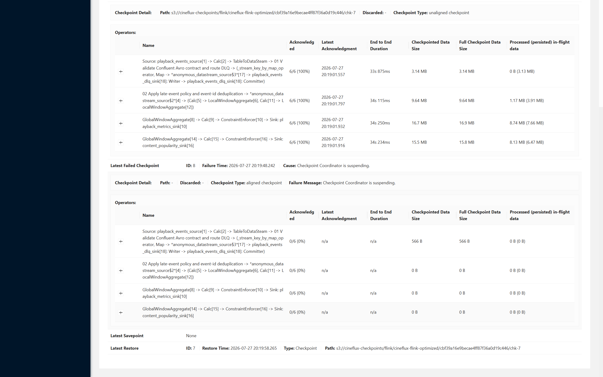 |

Final configuration: [`flink_optimized.yaml`](../data_platform/flink_jobs/config/flink_optimized.yaml).

### Correctness Query

```sql
SELECT window_start, user_id, count(*)
FROM streaming.playback_metrics_5m
GROUP BY window_start, user_id
HAVING count(*) > 1;

SELECT window_start, content_id, count(*)
FROM streaming.content_popularity_5m
GROUP BY window_start, content_id
HAVING count(*) > 1;
```
